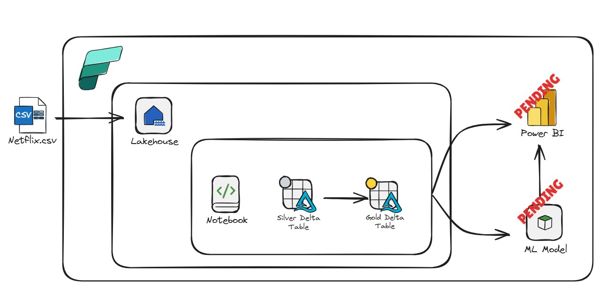
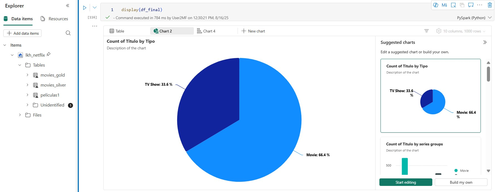
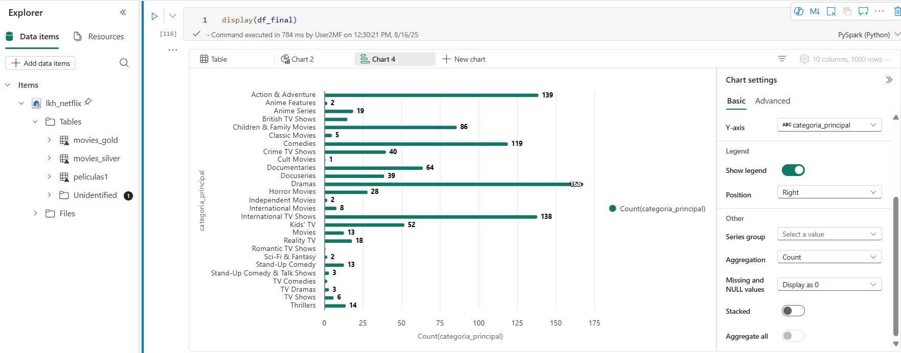

## Netflix Dataset

Se trabaja en el entorno de Microsoft Fabric aprovechando las funcionalidad y el motor de procesamiento de pyspark. 

**Nota:** Para correr el archivo en forma local verificar las librerías de python (pyspark, delta-spark, ipython, pandas)

### Arquitectura de la solución
Se procede a obtener la información desde el documento .csv compartido. Se lo carga en un lakehouse en ese formato considerándolo como la capa "Bronze". 

### Limpieza de Datos

#### Eliminación de Valores Nulos

Se recorre el dataframe y se elimina las filas que tienen algún dato vacío con el método 'dropna'
Se guarda este dataframe como tabla delta para posterior análisis.

#### Reemplazo de valores incompletos

Existen sólo dos filas con valores nulos.

Por lo tanto, se realiza el siguiente análisis para cada caso:
- **1° Fila**: No tiene datos a partir de la columna "director". **Corrección**: se reemplaza las columnas ausentes con los valores que más se repiten (Moda). 
- **2° Fila**: Parece que se debió a un error de carga de los datos en la tabla. **Corrección**: se desplaza las columnas hacia la derecha y se agrega un nuevo campo "show_id" con el último valor numérico de la tabla. Para la columna "type" se agrega arbitrariamente "Movie" puesto que es probable que se trate por la duración del mismo. 

##### Corrección 1° Fila

Ver resolución en notebook "Proyecto-1-Limpieza-y-Tranformacion_Ariel.ipynb".

##### Corrección 2° Fila

Ver resolución en notebook "Proyecto-1-Limpieza-y-Tranformacion_Ariel.ipynb".

##### Tabla Delta Silver

Con la resolución del paso anterior se obtiene un dataframe que es guardado como tabla delta silver.

#### Preguntas de guía
**¿Cuántos valores nulos encontrás en los datos? ¿Los puedes eliminar?**. Ver obtención de cantidad de nulos en notebook. Fueron eliminadas las filas que la contenían y se guardó como tabla delta "peliculas1".

**¿Cuántos valores incompletos encontrás en los datos? ¿Los puedes reemplazar?** Los valores incompletos son los nulos del paso anterior. Fueron reemplazados según el dataframe "df3".

**¿Podés eliminar columnas que no te aportan información? ¿Cuáles son? ¿Por qué las eliminarías?** Las columnas que no aportan información pueden ser: 
- "rating": Podría eliminarse porque no hay un criterio en términos da valores cuantitativos, por lo que puede ser despreciado. 

**¿Qué tipo de dato es la columna “release_year”? ¿Lo podes convertir a integer?** La columna "release_year" es de tipo "string" por defecto. Puede ser convertida en "integer" con los métodos propios de pyspark ("types.schema"). Ver notebook.

**La columna “listed_in” contiene diferentes valores separados por coma, ¿Podés crear una columna y quedarte con el primer valor?** La columna "listed_in" puede separarse con los métodos "split" de pyspark. 

Se procede ahora a castear el resto de las columnas para tener una tabla final mucho más limpia para poder ser provista para la analítica de datos.

Se procede a modificar el tipo de variable de las columnas para que pyspark pueda analizarlo mejor.

##### Tabla Delta Gold

Finalmente guardamos este dataframe como tabla delta. Asumiendo una arquitectura "Medallion", la consideramos la capa "Gold"

##### Ejemplos de Gráficas que se pueden obtener con charts de pyspark en Fabric

### EXTRA - PENDIENTES

- Conociendo los datos se pueden obtener diferentes gráficas representativas del modelo semántico en un dashboard de PowerBI. 

- También se puede utilizar los elementos de Ciencias de Datos que se encuentran incorporados en Fabric con el fin de obtener un modelo de recomendaciones en función de las preferencias del usuario. Este modelo puede ser reprensentado en métricas que también se pueden visualizar mediante PowerBI en el mismpo portal de Fabric.